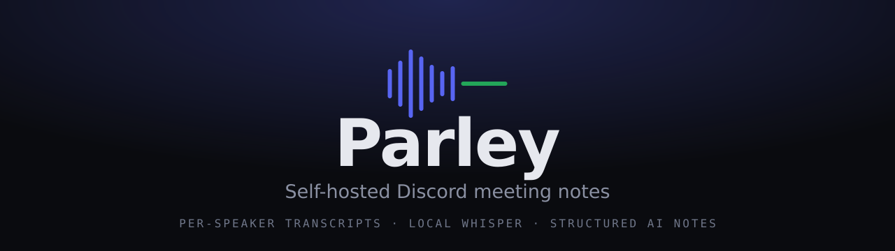
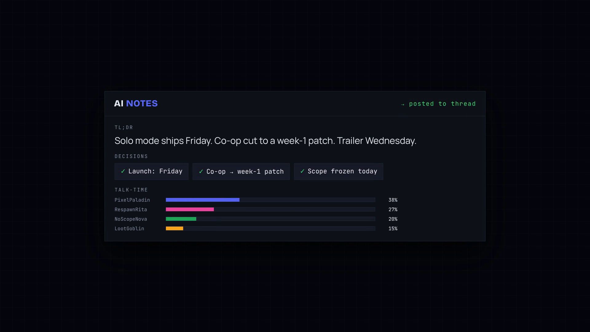
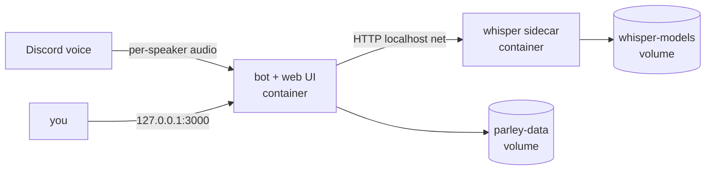

<p align="center">
  
</p>

<p align="center">
  <b>Parley</b> records your Discord voice meetings, transcribes them per-speaker on your own machine,
  and posts structured AI meeting notes straight into a thread.
</p>

<p align="center">
  = 22.5" />
  
  
  
  
</p>

<p align="center">
  <a href="https://sakethkanchi.github.io/parley-landing/"><b>🌐 Website</b></a> ·
  <a href="#-demo"><b>🎬 Demo</b></a> ·
  <a href="#-quick-start-docker"><b>🐳 Quick start</b></a> ·
  <a href="#-installation"><b>🚀 Install</b></a> ·
  <a href="#-commands"><b>💬 Commands</b></a> ·
  <a href="#-privacy--consent"><b>🔒 Privacy</b></a>
</p>

---

## 🎬 Demo

<p align="center">
  <a href="https://streamable.com/joqv9e">
    
  </a>
</p>

<p align="center">
  <a href="https://streamable.com/joqv9e"><b>▶ Watch the 20s demo</b></a>
</p>

<p align="center">
  <i>A live voice meeting becomes a per-speaker transcript, then structured notes — TL;DR, decisions, action items, talk-time — posted to a thread. All transcribed locally.</i>
</p>

---

A fully self-hosted alternative to Otter/Fathom/Fireflies, built for Discord. Audio is transcribed locally — only the final transcript text ever leaves your machine (to the summarizer you choose, or nowhere at all if you run a local model). No SaaS account, no per-seat pricing, no cloud recording.

## Table of contents

- [Demo](#-demo)
- [Features](#-features)
- [How it works](#-how-it-works)
- [Quick start (Docker)](#-quick-start-docker)
- [Where to host it](#-where-to-host-it)
- [Prerequisites](#-prerequisites)
- [Installation](#-installation)
- [Running](#-running)
- [Commands](#-commands)
- [Configuration](#-configuration)
- [Supported summarizers](#-supported-summarizers)
- [Privacy & consent](#-privacy--consent)
- [Development](#-development)
- [Contributing](#-contributing)
- [License](#-license)

## ✨ Features

- **Per-speaker transcripts, no ML diarization.** Discord delivers a separate audio stream per user, so every utterance is attributed to the right person exactly — not guessed.
- **Structured AI notes.** TL;DR, topic sections, decisions, open questions, and **action items grouped by the person responsible**, plus per-speaker talk-time stats.
- **Full web dashboard.** A local control panel to browse meetings, read notes, work the action-item list, see talk-time analytics, search transcripts, and configure everything. Connect your Discord bot and edit settings right from the browser — no editing files.
- **Pluggable summarizer.** Google Gemini (default, free tier), any OpenAI-compatible endpoint, or fully-offline Ollama — switch per-server with `/setup`, no restart.
- **Local speech-to-text.** A warm [faster-whisper](https://github.com/SYSTRAN/faster-whisper) sidecar; pick model size from `tiny` to `large-v3-turbo`.
- **Self-host in one command.** `docker compose up -d` runs the bot, the whisper sidecar, and the dashboard together. No public IP or port forwarding needed.
- **Searchable history.** `/history`, `/summary`, `/raw`, and full-text `/search` over every past meeting, backed by SQLite FTS5.
- **Resilient.** Failed transcriptions or summaries are retryable with one click from the dashboard (or the CLI).
- **Auto join/leave.** Joins when 2+ people are talking, leaves when the room empties. Shows `[REC]` in its nickname while recording.
- **Concurrent meetings.** Records multiple channels/servers at once — no global single-recording limit.

## ⚙️ How it works

```
┌─────────────────────────── Node bot (discord.js) ───────────────────────┐
│  Gateway events ─→ MeetingManager (per guild+channel, concurrent)        │
│      │                    │                                              │
│  per-user PCM capture   pipeline orchestrator                            │
│      │                    ├─→ STT client ──HTTP──┐                       │
│  [REC] nickname           ├─→ summarizer adapter │  (gemini|ollama|...)  │
│                           └─→ SQLite store        │                      │
└────────────────────────────────────────────────────┼───────────────────┘
                                                       │ localhost
                          ┌────────────────────────────▼─────────────┐
                          │  Python sidecar (FastAPI)                 │
                          │  faster-whisper, model loaded once (warm) │
                          └───────────────────────────────────────────┘
```

1. The bot joins a voice channel (via `/join` or automatically when 2+ humans are present) and writes each speaker's audio to its own track.
2. When the meeting ends, the orchestrator transcribes every track through the local sidecar, merges utterances into one timestamp-ordered, speaker-labeled transcript, and stores it in SQLite.
3. The transcript goes to your chosen summarizer, and the structured notes are posted to a Discord thread. Audio is deleted after successful delivery.

## 🐳 Quick start (Docker)

The fastest way to self-host. You need [Docker](https://docs.docker.com/get-docker/) (Compose v2) and a Discord bot token. Everything else — Node, Python, ffmpeg, the whisper model — is handled for you.

```bash
git clone https://github.com/SakethKanchi/parley.git
cd parley
cp .env.example .env          # you can leave it empty and configure in the browser
docker compose up -d --build
```

Then open **<http://127.0.0.1:3000>** and follow the first-run wizard:

1. Paste your **Discord bot token** and **Application (client) ID** (the dashboard links you to the right pages).
2. Parley connects instantly and registers its slash commands — no restart, no editing files.
3. Add your summarizer key (Gemini's free tier works great) on the Settings page, or pick **Ollama** for a fully offline setup.

That's it. The bot, the local whisper sidecar, and the dashboard all run as containers and restart with your machine. Your data (SQLite db + credentials) lives in a Docker volume and survives upgrades.



> **Updating:** `git pull && docker compose up -d --build`. Your volume keeps every meeting and your settings.

## 🌍 Where to host it

Parley's bot connects **out** to Discord over a websocket, so it needs **no public IP, no open ports, and no port forwarding**. That makes it happy almost anywhere that stays on:

| Option | Good for | Notes |
|--------|----------|-------|
| **Mini PC / NUC / old laptop** | Most people | Cheapest long-term. Leave it on, `docker compose up -d`, done. |
| **Raspberry Pi 4/5 (4 GB+)** | Low-power home use | Works great with the `tiny`–`small` whisper models; larger models are slow on a Pi. |
| **Home server / NAS** (Synology, Unraid, Proxmox) | Already-on hardware | Run the Compose stack as a normal container app. |
| **A small VPS** (Hetzner, Fly, DigitalOcean, etc.) | No always-on box at home | A 2 vCPU / 4 GB instance handles `small`/`medium` fine. Pick one near your Discord voice region. |

**Sizing the transcription:** whisper runs on CPU by default. `tiny`/`base` are realtime-ish anywhere; `small` is the sweet spot on a 4-core box; `medium`/`large-v3` want a beefier CPU (or a GPU build). You can change the model per-server in Settings without redeploying.

**Two ways to point at the summarizer:**

- **Cloud LLM (default):** only the final transcript *text* is sent to Gemini/OpenAI. Easiest, cheapest, great quality.
- **Fully offline:** run [Ollama](https://ollama.com) (on the host or another box) and select it in Settings. Nothing ever leaves your network.

> **Security:** the dashboard has **no authentication** and is bound to `127.0.0.1` (and, in Docker, published only to the host's localhost). To reach it from another machine, tunnel over SSH (`ssh -L 3000:127.0.0.1:3000 user@host`) or put it behind a reverse proxy **with auth** (e.g. Caddy + basic auth, Authelia, or a Tailscale/Cloudflare Tunnel). Do **not** expose port 3000 to the internet directly.

## 📦 Prerequisites

- **Node.js >= 22.5** — uses the built-in `node:sqlite` module (no native database build).
- **Python 3.10+** — for the speech-to-text sidecar.
- **ffmpeg** — bundled automatically via `ffmpeg-static`; no system install needed.
- A **Discord application + bot token** ([Discord Developer Portal](https://discord.com/developers/applications)).
- An **API key for at least one summarizer** — Gemini is the default and has a free tier; or run Ollama locally for zero cloud dependency.

## 🚀 Installation

> Prefer containers? Skip this and use the [Docker quick start](#-quick-start-docker) above — it bundles Node, Python, ffmpeg, and the sidecar, and you configure Discord from the browser. The steps below are for running Parley directly on the host (development, or if you don't want Docker).

### 1. Clone and install Node dependencies

```bash
git clone https://github.com/SakethKanchi/parley.git
cd parley
npm install
```

### 2. Set up the Python STT sidecar

```bash
cd stt_sidecar
python -m venv .venv
.venv/bin/pip install -r requirements.txt
cd ..
```

### 3. Configure environment variables

```bash
cp .env.example .env
```

Fill in `.env`:

```env
# Required
DISCORD_TOKEN=your_discord_bot_token
DISCORD_CLIENT_ID=your_discord_application_id

# STT sidecar URL (default is fine when running locally)
STT_URL=http://127.0.0.1:8000

# Summarizer — set the key for whichever provider you use
GEMINI_API_KEY=your_gemini_api_key      # gemini (default, free tier)
OPENAI_API_KEY=your_openai_api_key      # openai-compatible providers
OPENCODE_API_KEY=your_opencode_api_key  # opencode zen gateway
OLLAMA_URL=http://127.0.0.1:11434       # ollama (offline, no key needed)

# Optional: persistent data dir (defaults to /data if present, else cwd)
DATA_DIR=
```

> **Keys live in `.env` only.** `/setup` never accepts an API key — Discord retains message content, so a key typed into chat is a leak.
>
> **Or skip this file.** You can leave `.env` empty and set the Discord token, client ID, summarizer keys, and STT URL from the **web dashboard's first-run wizard** instead (see [Web dashboard](#web-dashboard-local)). Whatever you save there is written back to `.env` for you.

### 4. Invite the bot

In the Developer Portal → **OAuth2 → URL Generator**, select scopes `bot` and `applications.commands`. Under **Bot Permissions** select: Connect, Speak, Use Voice Activity, Send Messages, Create Public Threads, Embed Links. Open the generated URL to invite the bot.

> **No privileged intents required.** The bot runs on the standard `Guilds` and `GuildVoiceStates` intents only — you do **not** need to enable Server Members or Message Content.

## ▶️ Running

The bot needs **two processes** running together.

**Terminal 1 — STT sidecar** (first transcription downloads the whisper model, one-time):

```bash
npm run sidecar
```

> The sidecar runs inside its own Python virtualenv at `stt_sidecar/.venv`. The `npm run sidecar` script uses that interpreter automatically.

**Terminal 2 — Discord bot:**

```bash
npm start
```

> `npm start` loads `.env` automatically via Node's `--env-file` flag (Node 20+). If your shell already has empty `DISCORD_TOKEN=` etc., the `.env` values win.

For production, keep both alive with a process manager:

```bash
pm2 start "npm run sidecar" --name meeting-sidecar
pm2 start "npm start"       --name meeting-bot
pm2 save
```

> For most self-hosters, the [Docker quick start](#-quick-start-docker) is simpler and more robust than pm2 — it supervises both processes and restarts them with the host.

## 💬 Commands

| Command | Description |
|---------|-------------|
| `/join` | Join your current voice channel and start recording |
| `/leave` | Stop recording, post notes, and leave |
| `/status` | Check if the bot is recording, plus recent meetings |
| `/summary [meeting]` | Post the notes for a meeting (default: most recent) |
| `/history` | List recent meetings with status |
| `/raw [meeting]` | Dump raw meeting data: metadata, attendees, utterances, summary |
| `/search <keyword>` | Full-text search across all meeting transcripts |
| `/setup` | Configure the bot for this server (admin only) |

**Auto join/leave:** the bot joins automatically when more than one human is in a voice channel and leaves when one or zero remain. Toggle with `/setup autojoin`.

## 🎛️ Configuration

`/setup` (requires the **Manage Server** permission) writes per-guild config, applied without a restart.

| Option | Description |
|--------|-------------|
| `provider` | Summarizer: `gemini` (default), `openai`, `ollama` |
| `model` | Model name for the chosen provider |
| `whisper_model` | faster-whisper size: `tiny`, `base`, `small`, `medium`, `large-v3`, `large-v3-turbo` |
| `notes_channel` | Text channel where notes are posted (defaults to the meeting's channel) |
| `thread` | Post notes in a thread (default: on) |
| `autojoin` | Auto-join when 2+ people are in voice |
| `language` | Spoken language (German, English, …) or `auto`-detect |
| `summary_language` | Language for the notes/summary (default English), or `Match transcription` |

> **Mixed-language meetings:** if you speak one language with words from another mixed in (e.g. German with English terms), pick that base language explicitly (e.g. `German`) instead of `auto` — auto-detect can flip per audio chunk and garble the transcript. `summary_language` controls the notes language independently.

## 🧠 Supported summarizers

- **gemini** *(default)* — Gemini 2.5 Flash, free tier available. Set `GEMINI_API_KEY`.
- **openai** — any OpenAI-compatible endpoint. Set `OPENAI_API_KEY` (and `OPENAI_BASE_URL` for third-party gateways).
- **opencode** — [OpenCode Zen Go](https://opencode.ai/zen/go/v1/models) gateway (OpenAI-compatible). Set `OPENCODE_API_KEY`. Defaults to `deepseek-v4-flash` if no model is set. Use the **bare** model id (no `opencode/` prefix) — e.g. `deepseek-v4-flash`, `minimax-m3`, `kimi-k2.6`, `glm-5.1`, `qwen3.7-max`; full list at [`/zen/go/v1/models`](https://opencode.ai/zen/go/v1/models). Override the endpoint with `OPENCODE_BASE_URL` (default `https://opencode.ai/zen/go/v1`).
- **ollama** — fully offline, no key. Run Ollama locally and set `OLLAMA_URL`.

All providers return the same structured-notes shape, so output is consistent regardless of which you pick.

## 🔒 Privacy & consent

- The bot shows `[REC]` in its nickname whenever a recording is active, so every member can see it.
- Audio is transcribed **on the machine running the bot**. No audio is uploaded anywhere; only the final transcript text is sent to your chosen summarizer (and nothing leaves your network at all with Ollama).
- Recording people's voices is subject to consent laws that vary by jurisdiction (some require all-party consent). **You are responsible for obtaining consent from all participants.**

## Web dashboard (local)

Parley ships a full local web dashboard for browsing meetings, reading AI
notes, working the action-item list, searching transcripts, viewing talk-time
analytics, **connecting your Discord bot**, and editing per-guild config. With
Docker it's already running; otherwise build it once and start the bot with it
enabled:

    npm run web:build
    WEB_UI=1 npm start

Open <http://127.0.0.1:3000>.

**First-run wizard.** If no Discord credentials are set yet, the dashboard opens
on an onboarding screen instead of crashing: paste your bot token + Application
ID (and optionally the STT URL) and Parley connects and registers its slash
commands live, no restart. You can edit the connection any time from
**Settings → Connection**, which also shows the bot's live status and a
Reconnect button. Anything you save is written to `.env` (under `DATA_DIR`, so it
persists across container restarts).

The rest of the dashboard has a Dashboard overview, a Meetings browser
(grid/list), a per-meeting reading view with collapsible transcript and an
"Ask this meeting" box, an Action items board filterable by person, an Analytics
page (meetings-per-day, talk-time and word leaderboards), full-text Search, a
Commands reference (every slash command, grouped), and Settings (summarizer
provider/model picker, in-app API-key editing, whisper model, languages,
delivery).

**Recover failed meetings without the CLI.** If a meeting fails (the STT sidecar
was down, or the summarizer hit a transient error), it shows up with a clear
status and a one-click **Retry** in its reading view. Parley picks the right
recovery automatically: re-summarize when the transcript survived, or
re-transcribe from the saved audio when it didn't. (The `scripts/*-meeting.mjs`
helpers still exist for the terminal.)

**Develop the UI without the bot.** `npm run web` serves the API + built UI
against your existing `meetings.db` with no Discord token required, so you can
work on the dashboard against real data:

    npm run web:build      # build the UI once
    npm run web            # API + UI on http://127.0.0.1:3000

For hot-reload UI development, run `npm run web` (the API on :3000) in one
terminal and `npm run web:dev` (Vite on :5173, proxies `/api` to :3000) in
another.

**Security:** the UI binds to 127.0.0.1 only and has NO authentication. Do not
port-forward or reverse-proxy it to the internet without adding auth first. It
never returns API keys or the Discord token to the browser — those stay in
`.env` and only their "is it set?" status is shown.

## 🛠️ Development

```bash
npm test                                                        # all Node unit tests (node --test)
node --test test/<name>.test.js                                 # a single test file
cd stt_sidecar && .venv/bin/python -m pytest test_server.py -q  # sidecar tests
npm run make:art                                                # regenerate the README brand art (assets/)
```

**Project layout:**

```
src/
  index.js                   # entrypoint: starts web UI, lazy-starts the bot
  bot.js                     # all Discord wiring (startBot)
  bot-controller.js          # bot lifecycle: start/stop/restart/status
  config/env.js              # env + DATA_DIR + persistent .env (single source of truth)
  voice/                     # capture, meeting-manager, audio, decisions
  pipeline/                  # transcribe, summarize, orchestrator
  adapters/                  # stt-client + summarizer/{gemini,ollama,openai,fake}
  store/                     # db (node:sqlite + FTS5), per-guild config, secrets/.env writer
  delivery/                  # notes rendering + Discord posting
  commands/                  # slash command definitions + /setup validation
  web/                       # express api + server (serves web/dist)
web/                         # React dashboard (Vite + Tailwind)
stt_sidecar/                 # Python FastAPI faster-whisper sidecar (+ Dockerfile)
Dockerfile                   # bot + web image (multi-stage)
docker-compose.yml           # bot + sidecar + volumes, one-command deploy
scripts/make-brand-art.mjs   # generates assets/{banner,logo,icon} from SVG
test/                        # node --test suites
docs/superpowers/            # design spec + implementation plan
```

**Tech stack:** Node 22.5+ (ESM, `node:sqlite`, native `fetch`, `node --test`), [discord.js](https://discord.js.org) v14, `@discordjs/voice`, `prism-media`, `ffmpeg-static`, `@google/generative-ai`; Python + FastAPI + [faster-whisper](https://github.com/SYSTRAN/faster-whisper).

The marketing site lives in a separate repo, [`parley-landing`](https://github.com/SakethKanchi/parley-landing) (Astro + Tailwind + GSAP).

## 🤝 Contributing

Contributions are welcome.

1. Fork the repo and create a feature branch.
2. Keep modules small and single-purpose; follow the existing structure.
3. Add tests for new logic — `npm test` and the sidecar `pytest` must pass.
4. Open a pull request describing the change and the reasoning.

For bugs and feature requests, please open an issue.

## 📄 License

[ISC](./LICENSE) © Saketh Kanchi
